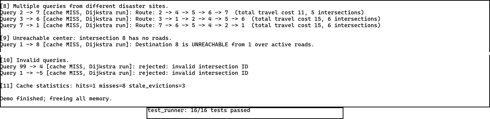
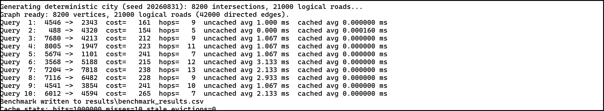

# Intelligent Emergency Evacuation Routing System

This project was built for our **CSA0312 – Data Structures (Slot B)** final assignment.

The idea is to represent a city road network as a weighted graph and find the best available evacuation route during a disaster. Road costs can change because of congestion or damage, and roads can also be blocked and reopened while the program is running.

The project is a **C-based course prototype** tested using synthetic city data. It is not meant to be a real emergency-navigation system.

## What the system does

The program can:

- store a large, sparse road network using a HashMap-based adjacency list
- add and manage bidirectional weighted roads
- update road weights when conditions change
- block and reopen roads without deleting them
- find the minimum-cost route using Dijkstra's algorithm
- use a Min-Heap as the priority queue for Dijkstra
- use a HashSet so the same intersection is not processed repeatedly
- reconstruct and print the complete route
- cache repeated source-to-destination queries
- automatically invalidate old cached routes after a graph change
- detect invalid intersections, duplicate roads, negative weights and unreachable destinations

For testing at scale, the program also creates a deterministic synthetic city with **8,200 intersections and 21,000 logical roads**.

## Why these data structures were used

The city network is very sparse, so an adjacency matrix would waste a large amount of memory. Instead, we used an adjacency list and a HashMap so intersection IDs can be looked up quickly.

A **Min-Heap** is used to efficiently pick the next lowest-cost vertex in Dijkstra, while a **HashSet** keeps track of processed intersections. For repeated queries, a separate route cache stores previously calculated routes. The graph has a version number, so if any road changes, an older cached route is treated as stale and recalculated.

## Main files

| File | Purpose |
|---|---|
| `src/graph.c` / `graph.h` | Graph, intersections, roads and road updates |
| `src/hashmap.c` / `hashmap.h` | Intersection ID to vertex lookup |
| `src/hashset.c` / `hashset.h` | Processed-intersection tracking |
| `src/minheap.c` / `minheap.h` | Priority queue operations |
| `src/dijkstra.c` / `dijkstra.h` | Shortest path and route reconstruction |
| `src/route_cache.c` / `route_cache.h` | Repeated-query cache and invalidation |
| `src/console_ui.c` / `console_ui.h` | Interactive console interface |
| `src/main.c` | Demo, benchmark and road-failure modes |
| `tests/test_runner.c` | Functional test cases |

## Building the project

With a modern GCC/Clang setup and `make`:

```bash
make
```

On Windows without `make`:

```bat
build.bat
```

The source is standard C and is valid under C99/C11. The report also documents the linker workaround that was needed when testing with the older GCC 3.4.2 toolchain on Windows.

## Interactive program

Run the executable without arguments:

```bat
bin\evacsim.exe
```

The main menu lets you open the interactive route planner, run the guided demo, run the full benchmark, run the 30% road-failure experiment, or view a short architecture/complexity summary.

Inside the route planner, you can view the demo roads, find a route, update a road weight, block/reopen a road, check cache statistics and reset the demonstration city.

One simple example is route **1 → 4**. The first request is calculated using Dijkstra and stored in the cache. Repeating the same request without changing the graph gives a cache hit. If road **2–4** is blocked, the old cached route becomes stale and the program calculates a new route automatically.

## Other run modes

Guided demonstration:

```bat
bin\evacsim.exe demo
```

Functional tests:

```bat
bin\test_runner.exe results\test_results.txt
```

Full-scale benchmark:

```bat
bin\evacsim.exe bench results\benchmark_results.csv
```

30% road-failure experiment:

```bat
bin\evacsim.exe fail results\road_failure_analysis.txt
```

## Results

The final verified run produced:

- **16/16 functional tests passed**
- benchmark graph: **8,200 intersections and 21,000 logical roads**
- average uncached query time: about **3.91 ms**
- worst recorded uncached query: **7.000 ms**
- average cached lookup: about **0.00003 ms**
- after blocking exactly **6,300 roads (30%)**, **8,026 of 8,200 intersections** were still reachable from the reference source

The timing values are specific to the machine used for testing, but the recorded run stayed comfortably below the assignment's **200 ms** routing target.

The raw results are kept in the `results/` folder instead of only being written in the report.

## Verified output

<details>
<summary>Demo and functional tests</summary>



</details>

<details>
<summary>Full-scale benchmark</summary>



</details>

<details>
<summary>30% road-failure experiment</summary>


</details>

## Complexity summary

| Operation | Time complexity | Space |
|---|---|---|
| HashMap vertex lookup | O(1) average | O(V) total |
| Road add/update/block | O(degree) | O(1) additional |
| Heap insert / extract-min / decrease-key | O(log V) | O(V) |
| Dijkstra with binary heap | O((V + E) log V) | O(V) working |
| Route reconstruction | O(L) | O(L) |
| Cache lookup / store | O(1) average | depends on cached routes |
| Graph storage | — | O(V + E) |

Floyd–Warshall was analysed for comparison, but it is not suitable for this full network because its O(V³) running time and O(V²) memory are too expensive for a large, changing, sparse graph.

## Limitations

This is still a student prototype, so there are a few important limitations:

- the road network is synthetic rather than real map data
- there is no GPS or live traffic feed
- the program is single-threaded
- each road has one combined safety-adjusted cost instead of separate distance and safety scores
- any graph change invalidates all cached routes, which is simple and correct but not very selective
- `clock()` has limited timing resolution, so very fast operations are measured in batches

## Report and viva notes

- [Final assignment report (PDF)](report/CSA0312_Final_Assignment_Report.pdf)
- [Final assignment report (Word)](report/CSA0312_Final_Assignment_Report.docx)
- [Rubric checklist](report/rubric_checklist.md)
- [Short viva guide](docs/VIVA_GUIDE.md)

The detailed design decisions, pseudocode, testing, Dijkstra vs Floyd–Warshall comparison, performance analysis and SDG reflection are all explained in the report.
